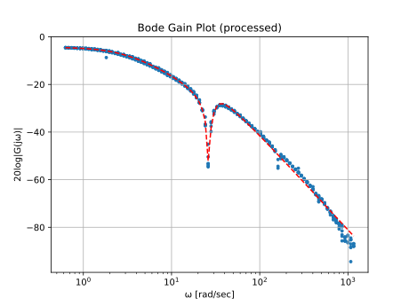

# フレキシブルリンク 共通課題プレゼン

2025-04-25 | システム工学実験2025

---

<!--
header: フレキシブルリンク 共通課題プレゼン
-->

# メンバー

<style scoped>
   div {
      width: 60%;
      margin: 0 auto;
   }
   h2 {
      text-align: center;
   }
</style>

<div class="columns">

## システム同定

- 石田大輝
- 梅田竜成
- 佐々木哉人

## 制御器設計

- 亀山 ？
- 黒川啓太

</div>

---

<!--
header: フレキシブルリンク 共通課題プレゼン :: システム同定
-->

# システム同定

---




---

# やったこと (Week 1)

1. データから Bode Gain plot・Nyquist plot を手元で作れるようにする
2. 1時間のサンプルデータの Bode Gain plot を見て前処理アルゴリズムを考える
   - 隣の点へのベクトルの偏角の変化を追跡する
   - 各点についてなめらかに移動できる点の数でスコアをつける
   - 谷の点を増やす
   - 両隣より y 座標が高すぎる点を除去する
3. curve fit してみる
   - `scipy.optimize.curve_fit` with 初期値エスパー
   - Nyquist plot も合うように

---

# やったこと (Week 2)

4. 10時間のデータで試す
   - 結論：前処理、いる...？
   - y 座標フィルター × 3 で外れ値はだいたい除去できるが、fit 結果は大差ない
5. 安定性を確かめねばならない
   - 0 がひとつ、それ以外は実部が負
6. 実機で試してみる
   - だいぶよさそう

---

```sh
uv run ./src/cmd/graphviz.py ./data/SKE2024_data16-Apr-2025_1819.dat -n 3
              ω   SysGain  SysPhase
0       0.62832  0.588400  -0.27260
1       0.62832  0.588490  -0.27141
2       0.62832  0.591260  -0.25658
3       0.62832  0.592790  -0.25505
4       0.62832  0.593610  -0.25010
..          ...       ...       ...
996  1161.90000  0.000051   0.70787
995  1161.90000  0.000050   0.63840
994  1161.90000  0.000045   0.67173
998  1161.90000  0.000125  -2.27350
999  1161.90000  0.000384  -2.35430

[1000 rows x 3 columns]
saved direct plots

# 省略

optimal parameters: [5.80059307e+01 1.60887536e+03 4.03510419e+04 8.83556050e+01 6.13555006e+04]
standard deviation errors: [  1.13635683  27.22681206 706.15731349   0.94212143 655.58920027]
saved processed plots
roots: [-42.4911406573249, 0.0, -7.7573950189422 - 29.8237666653607*I, -7.7573950189422 + 29.8237666653607*I]
The system is stable.
```

---

なんか画像

<!-- 正弦波のやつとか -->

---

<!--
header: フレキシブルリンク 共通課題プレゼン :: 制御器設計
-->

# 制御器設計

---

# やったこと (Week 1)

1. 
2. 
